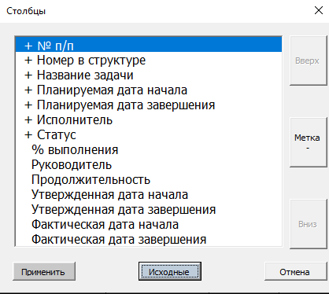
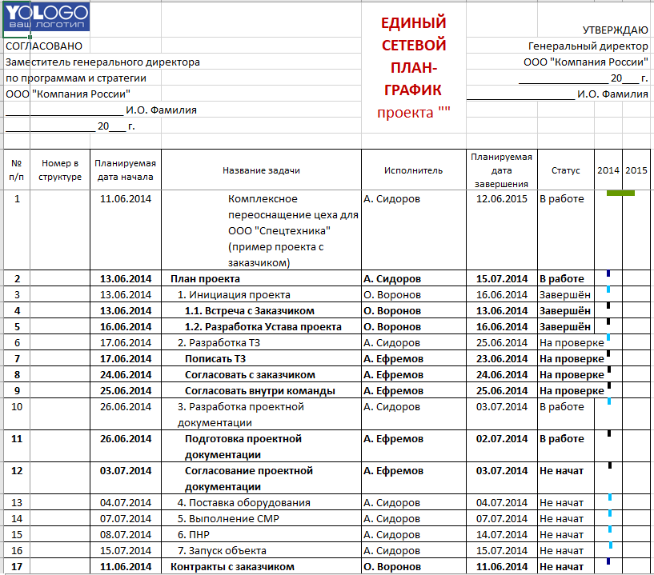

# Сброс параметра отображаемых столбцов на диаграмме до стандартного.

## Предусловия:

- [Скачан файл](https://disk.yandex.ru/d/IXRviK5MR12Kuw)

- Скачанный файл открыт в MS Excel

- Нажата кнопка "Включить содержимое" на вспылвающем окне, в верхней части открытого файла.

- Открыта вкладка Гант в верхней части MS Excel

- Построена диаграмма Ганта.

- В диаграмму через кнопку "Столбцы":
  
  - Изменён порядок столбцов кнопками Вверх и Вниз.
  
  - Добавлены новые столбцы.

## Шаги:

1. В верхней части MS Excel нажать кнопку "Столбцы".

2. Нажать кнопку "Исходные".

> О.Р.
> 
> - Вид окна изменился до стандартного вида.
>   

3. Нажать кнопку "Отмена"

> О.Р.
> 
> - Окно закрылось.
> - В диаграмме никаких изменений не произошло.

4. Повторить шаг 1-2.

5. Нажать кнопку "Применить".

## Результат:

- Все промежуточные О.Р. выполняются.

- Диаграмма вернулась к стандартному виду.

