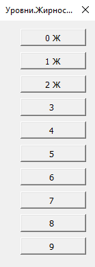

# Сброс жирности шрифта для уровней объектов на диаграмме до стандартного.

## Предусловия:

- [Скачан файл](https://disk.yandex.ru/d/IXRviK5MR12Kuw)

- Скачанный файл открыт в MS Excel

- Нажата кнопка "Включить содержимое" на вспылвающем окне, в верхней части открытого файла.

- Открыта вкладка Гант в верхней части MS Excel

- Построена диаграмма Ганта.

- У шрифтов, присутствующих в проекте (0-3) изменён параметр жирности на другой, отличный от стандартного.

## Шаги:

1. В верхней части MS Excel нажать кнопку "Уровни".

2. Нажать кнопку "Исходные".

> О.Р.
> 
> - У уровней 0-3 жирность шрифта вернулась к стандартной:
>   
> - В диаграмме никаких изменений не произошло

3. Нажать кнопку "Отмена"

> О.Р.
> 
> - Окно закрылось.
> - В диаграмме никаких изменений не произошло.

4. Повторить шаги 1-2.

5. Нажать кнопку "Применить".

## Результат:

- Все промежуточные О.Р. выполняются.

- На диаграмме все шрифты вернулись к стандартным параметрам жирности в зависимости от уровня объекта.
